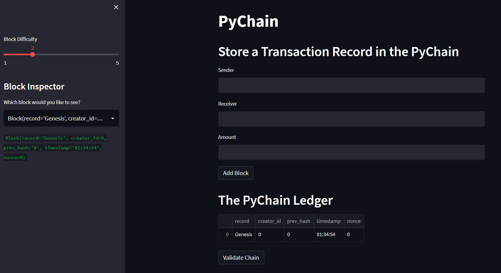
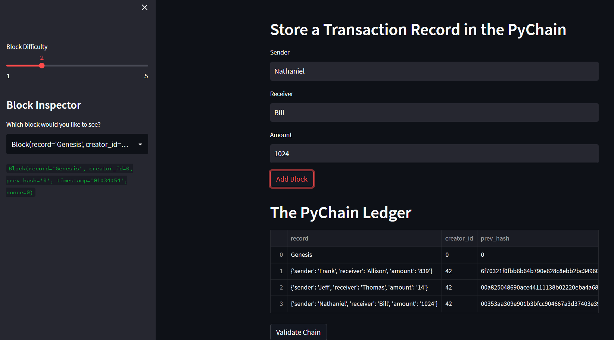
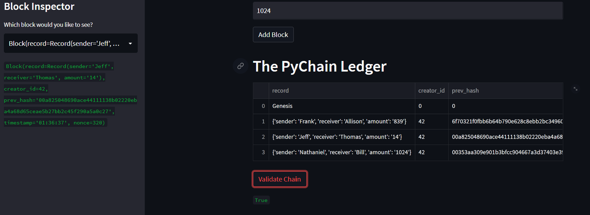

# blockchain_ledger_app
This is an blockchain [web application]() built using python and deployed using streamlit that allows users to conduct transactions and verify the integrity of the data.

This is what you will see before any transactions are added:


After adding a few transactions:


Verifying a block:


---

## Technologies

This analysis uses Python and the following libraries:
* [Pandas](https://pandas.pydata.org/) - Provides data manipulation and visualization.
* [dataclass](https://docs.python.org/3/library/dataclasses.html) - Provides a decorator and functions for automatically adding generated special methods.
* [Typing](https://docs.python.org/3/library/typing.html) - Provides runtime support for type hitns
* [datetime](https://docs.python.org/3/library/datetime.html) - Provides classes for manipulating dates and times
* [hashlib](https://docs.python.org/3/library/hashlib.html) - Implements a common interface to many different secure hash and message digest algorithms.
---

## Installation Guide

You can use the streamlit web app at [this link](). 

OR

You can run it locally, if you'd like to repurpose it for your own use. To do so please follow these steps:

1. Download and install [Anaconda](https://www.anaconda.com/products/distribution). 

2. Clone the the blockchain_ledger_app repository to your local machine.

3. Navigate to the directory of the cloned repo in your terminal/gitbash.

4. Run the following command in your terminal or gitbash:
```python
pip install -r requirements.txt
```

5. Run the following command in your terminal or gitbash:
```python
streamlit run pychain.py
```

---

## Usage

After lauching the application through the [streamlit app]() or by running it locally on your computer you can add transactions and verify those transactions.
---

## Contributors

Derick Decesare | [LinkedIn](https://www.linkedin.com/in/derickdecesare/) | derick.decesare@gmail.com

